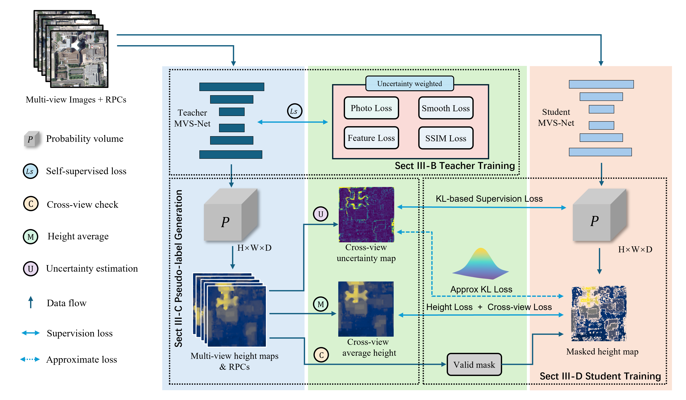

# 🛰️ Un-KD-MVS-Sat
**Unsupervised Self-Training Knowledge Distillation for Satellite Multi-View Stereo**

*Created: June 29, 2025*  
*Author: Liu Chen (刘晨), Wuhan University*  

---

## 🧠 Overview
**Un-KD-MVS-Sat** is an **unsupervised knowledge distillation framework** for **satellite multi-view stereo (MVS)** reconstruction.  
It introduces a *teacher–student self-training pipeline* that leverages **uncertainty-aware pseudo-labels** instead of LiDAR supervision.


The framework integrates:
- **Self-supervised teacher training** using photometric and geometric consistency.  
- **Uncertainty-weighted pseudo-label generation** (depth, uncertainty, and visibility).  
- **KL-based distillation** to transfer multi-modal depth distributions to a lightweight student.  
- **Iterative self-training** for domain adaptation and computational efficiency.

---

## 📦 Datasets

To **train and evaluate** *Un-KD-MVS-Sat*, you will need to prepare several benchmark datasets commonly used for satellite MVS.

| Dataset | Description | Download |
|----------|--------------|-----------|
| **[WHU-TLC](https://github.com/WHU-GPCV/SatMVS/blob/main/WHU_TLC/readme.md)** | High-resolution tri-stereo imagery captured by Pleiades satellites with precise LiDAR ground truth. | Public GitHub repository |
| **[US3D-MVS (DFC2019)](https://ieee-dataport.org/open-access/data-fusion-contest-2019-dfc2019)** | Multi-view WorldView-3 imagery over Jacksonville and Omaha, provided by the IEEE GRSS Data Fusion Contest. | IEEE DataPort |
| **[DTU (training data)](https://drive.google.com/file/d/1eDjh-_bxKKnEuz5h-HXS7EDJn59clx6V/view)** | Indoor benchmark dataset used for initial pre-training and depth regularization. | Google Drive |
| **[DTU (Depths raw)](https://virutalbuy-public.oss-cn-hangzhou.aliyuncs.com/share/cascade-stereo/CasMVSNet/dtu_data/dtu_train_hr/Depths_raw.zip)** | Raw ground-truth depth maps of DTU for evaluation. | Public link |
| **[DTU (testing data)](https://drive.google.com/file/d/1rX0EXlUL4prRxrRu2DgLJv2j7-tpUD4D/view?usp=sharing)** | Test set for generalization verification. | Google Drive |
| **[Model SP-MVS](https://drive.google.com/file/d/1b8i1u69_9yMPJyqGcuTkCocyg0rVg4P3/view?usp=sharing)** | Pretrained model for student initialization. | Google Drive |

Additionally, both **US3D-MVS** and **MVS3D** datasets can be automatically acquired or organized using my MVS data preparation tool:  
👉 [**Sat-MVS-Dataset**](https://github.com/Tian8du/Sat-MVS-Dataset)

---

## ⚙️ Environment Setup

You can easily reproduce the environment using the provided Conda configuration file:

```bash
conda env create -f environment.yml
conda activate UnKD_MVS_Sat
```

Main dependencies:
- Python ≥ 3.8
- PyTorch ≥ 1.12
- CUDA ≥ 11.3
- GDAL ≥ 3.4
- CuPy, OpenCV, NumPy, SciPy, PyYAML, tqdm, einops, matplotlib

> If `GDAL_DATA` or `PROJ_LIB` paths are missing, please export them manually as described below.

---

## 🚀 Running the Code

1) Configure dataset paths  
2) Train the teacher (unsupervised)  
3) Generate pseudo-labels (depth + uncertainty + visibility)  
4) Distill the student  
5) Evaluate

Refer to the README for detailed bash commands.

---

## 📊 Results Summary

| Dataset | Method | MAE ↓ | RMSE ↓ | <1 m ↑ | <2.5 m ↑ | Runtime ↓ |
|:--|:--|:--:|:--:|:--:|:--:|:--:|
| **US3D (JAX+OMA)** | Ours (Student) | **0.427 m** | 0.551 m | **68.03%** | **85.99%** | **~21 min** |
| **WHU–TLC** | Ours (Student) | **2.335 m** | **3.841 m** | — | **80.35%** | — |

---

## 🙏 Acknowledgment

This project was developed at the **GPCV Laboratory, Wuhan University**.  
Special thanks are also extended to the GPCV research group for providing valuable feedback, datasets, and computational support.  
This work builds upon prior open-source frameworks, including **Sat-MVSF**, **CasMVSNet**, and **UCS-Net**, whose authors are gratefully acknowledged for their significant contributions to the community.

---

## 📄 Citation

```bibtex
@article{liu2025unkd_mvssat,
  title   = {Unsupervised Knowledge Distillation for Satellite Multi-View Stereo with Uncertainty-Aware Supervision},
  author  = {Chen Liu and Yong-Hua Jiang},
  journal = {IEEE Transactions on Geoscience and Remote Sensing},
  year    = {2025},
  note    = {Early Access}
}
```

---

## 📬 Contact

- **Author**: Liu Chen (刘晨), Wuhan University  
- **Email**: <sweet8degree@gmail.com>

---

## 📑 License

This project is released under the **MIT License**. See [`LICENSE`](LICENSE) for details.
